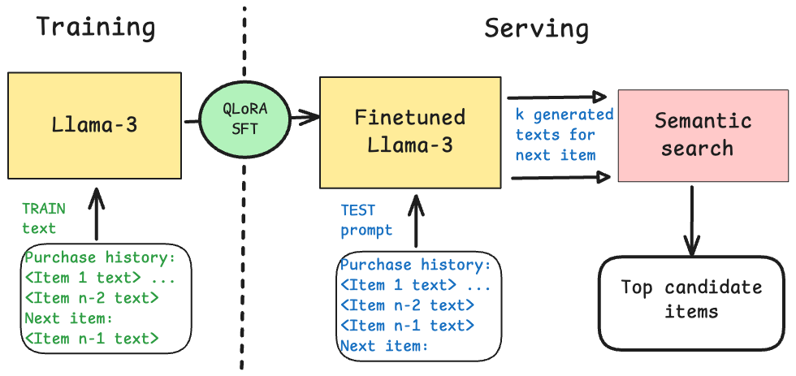
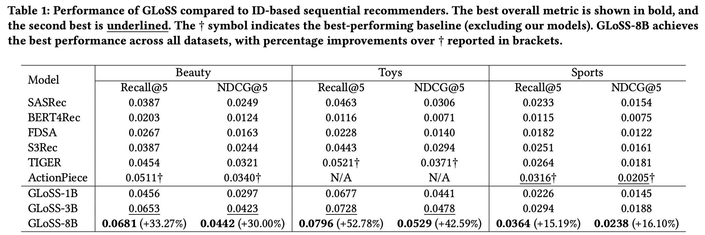
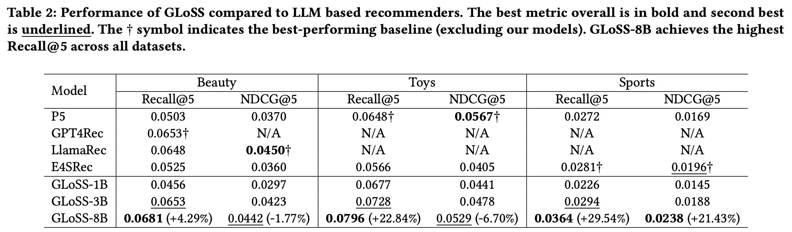

# GLoSS: Generative Language Models with Semantic Search for Sequential Recommendation

[](https://arxiv.org/abs/2506.01910)

This repository contains the codebase and model checkpoints for our paper "GLoSS: Generative Language Models with Semantic Search for Sequential Recommendation" (arXiv:2506.01910).



We propose GLoSS, a generative recommendation framework that combines large language models with dense retrieval for sequential recommendation. For query generation, we use 4-bit quantized LLaMA-3 models fine-tuned with low-rank adaptation (LoRA), enabling efficient training on a single RTX A5000 (24GB VRAM). We evaluate GLoSS on three real-world Amazon review datasets: Beauty, Toys, and Sports, and find that it achieves state-of-the-art performance. Compared to traditional ID-based baselines, GLoSS improves Recall@5 by 33.3%, 52.8%, and 15.2%, and NDCG@5 by 30.0%, 42.6%, and 16.1%, respectively. It also outperforms LLM-based recommenders such as P5, GPT4Rec, LlamaRec, and E4SRec with Recall@5 gains of 4.3%, 22.8%, and 29.5%. Additionally, user segment evaluations show that GLoSS performs particularly well for cold-start users in the Amazon Toys and Sports datasets, and benefits from longer user histories in the Amazon Beauty dataset, demonstrating robustness across different levels of interaction lengths.





## Requirements

GLoSS depends on the following components:

- **[Unsloth](https://github.com/unslothai/unsloth)** – for QLoRA fine-tuning
- **[Retriv](https://github.com/AmenRa/retriv)** – for building dense retrieval indices
- **[vLLM](https://github.com/vllm-project/vllm)** *(optional)* – for faster generation

We provide two Conda environments in the `envs` directory:
- `glosstune.yml` – contains Unsloth for model fine-tuning
- `glossret.yml` – contains Retriv for retrieval setup

> **Note:** Our workstation uses RTX A5000 GPUs (CUDA 10.1). Due to CUDA compatibility and library conflicts, we maintain separate environments.

## Datasets and Preprocessing

We use the core-5 subset of the Beauty, Toys, and Sports categories from the Amazon Reviews dataset, based on reviews spanning May 1996 - July 2014. The data is available at:
- https://nijianmo.github.io/amazon/
- https://snap.stanford.edu/data/amazon/productGraph/

For convenience, we provide a script that downloads, preprocesses, and creates HuggingFace datasets from these sources.

To process the data, run:
```bash
chmod +x ./scripts/pulldata_process.sh
nohup ./scripts/pulldata_process.sh > pulldata_process.log 2>&1 &
```

This creates the `hfdataset`, `reviews`, and `data/processed` directories.

For backup purposes, in case the URLs become unavailable, we also provide these processed datasets at [this link](https://drive.google.com/file/d/1nYleGIZA2gBp9VfFLS6PiFc0myaKldlK/view?usp=drive_link).

## QLoRA SFT

For supervised fine-tuning, we use Unsloth's QLoRA. Fine-tuning configurations for each of the three datasets and each Llama-3 model size (Llama-3.1-8B, Llama-3.2-3B, and Llama-3.2-1B) are available in the `ft_configs` directory.

The trained model checkpoints are available on [Google Drive](https://drive.google.com/file/d/101olRNCsDW1rkOpUJVy5cHah9N29ZIIt/view?usp=drive_link).

To download and set up the checkpoints:
```bash
# Install gdown if not already installed
pip install gdown

# Download the model checkpoints
gdown 101olRNCsDW1rkOpUJVy5cHah9N29ZIIt

# Unzip the downloaded file
unzip trained_models.zip

# Rename trained_models directory to llama_modelsave as required by gen_withbeams
rm -rf llama_modelsave
mv trained_models llama_modelsave
```

## Generation

To generate recommendations, we use beam search decoding with 5 beams and 50 max new tokens using `src/generate_withbeams.py`.

Assuming you've downloaded our checkpoints, here's how to run generation on the validation users. This will generate files in the `genqueries/toys/` folder with the val suffix, specifically saving the file `Llama-3.2-1B-fttoys_ep10_maxseq1024_bs4_acc4_validation_beam5_max_seq1024_bs8_numret5.json` in the toys folder.

```bash
nohup python src/generate_withbeams.py \
    --model_name toys-bestmodels/Llama-3.2-1B-fttoys_ep10_maxseq1024_bs4_acc4 \
    --dataset_name toys \
    --dataset_split validation \
    --max_seq_length 1024 \
    --num_beams 5 \
    --batch_size 8 \
    --num_return_sequences 5 \
    --max_new_tokens 50 \
    --load_in_4bit True \
    > genop_toys_val_llama1b.log 2>&1 &
```

## Retrieval

> **Note:** First activate the glossret environment.

To evaluate and calculate metrics for the generated file:

```bash
# Create directory for the generated file if it doesn't exist
mkdir -p ./genqueries/toys/llama-1b/

# Move the generated file to the correct directory
mv ./genqueries/toys/Llama-3.2-1B-fttoys_ep10_maxseq1024_bs4_acc4_validation_beam5_max_seq1024_bs8_numret5.json ./genqueries/toys/llama-1b/

# Run the metrics calculation with BM25 as retriever
nohup python src/calcirmetrics_bm25_dataset_agno.py \
    --dataset_name toys \
    --data_family amazon \
    --generated_file llama-1b/Llama-3.2-1B-fttoys_ep10_maxseq1024_bs4_acc4_validation_beam5_max_seq1024_bs8_numret5.json \
    --retriever_index toys_index \
    --num_sequences 5 \
    --split validation \
    --short_model_name llama-1b \
    > calc_irmetrics_bm25_toysval.log 2>&1 &

# Run the metrics calculation with e5-small-v2 as retriever
nohup python src/calcirmetrics_denseret_dataset_agno.py \
    --dataset_name toys \
    --data_family amazon \
    --generated_file llama-1b/Llama-3.2-1B-fttoys_ep10_maxseq1024_bs4_acc4_validation_beam5_max_seq1024_bs8_numret5.json \
    --split validation \
    --short_model_name llama-1b \
    --encoder_name intfloat/e5-small-v2 \
    --use_ann False \
    > calc_irmetrics_e5-small_toysval.log 2>&1 &
```

We provide scripts to run this across all datasets:

```bash
chmod +x ./scripts/get_sparsebm25_ret_metric.sh
chmod +x ./scripts/get_dense_ret_metrics_test.sh

nohup ./scripts/get_sparsebm25_ret_metric.sh > table3_sparsebm25.log 2>&1 &
nohup ./scripts/get_dense_ret_metrics_test.sh > table3_e5smallv2.log 2>&1 &
```

## Evaluation Across User Segments

```bash
nohup python src/evaluate_userseg_combined.py > userseq-encoders/combined_final.log
```

All metrics are available in the `all_metrics_logged` folder.

## Last Item Search (LIS) Baseline

```bash
chmod +x ./scripts/get_LIS_sparseBM.sh
chmod +x ./scripts/LIS_dense.sh

nohup ./scripts/get_LIS_sparseBM.sh > LIS_bm25.log 2>&1 &
nohup ./scripts/get_LIS_sparseBM.sh > LIS_e5small.log 2>&1 &
```

